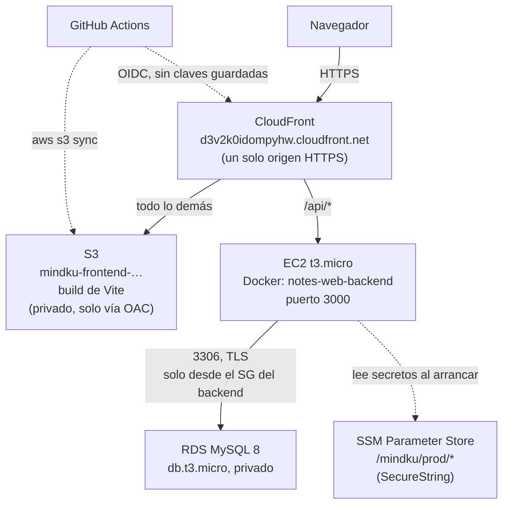

# Despliegue en AWS — evidencia de portafolio

> **Estado: los recursos fueron destruidos el 2026-08-08 tras capturar la
> evidencia** — auditoría recurso por recurso en
> [`evidence/teardown-auditoria.txt`](evidence/teardown-auditoria.txt).
> El despliegue vivo del proyecto sigue siendo Railway (backend + MySQL) y
> Vercel (frontend). Este documento describe una migración real que se montó,
> se verificó de punta a punta y se desmanteló, con un costo total de $0.
> La infraestructura estuvo viva unos 45 minutos.

Todo se hizo con AWS CLI desde la línea de comandos, en la región
**us-east-2 (Ohio)**, sobre una cuenta nueva bajo el Free Tier basado en
créditos ($100 USD / 6 meses — no el Free Tier clásico de 12 meses).

## Arquitectura

### Por qué CloudFront con dos orígenes

El backend en EC2 solo habla HTTP (darle HTTPS propio exigiría comprar un
dominio y un certificado). Si el frontend, servido por HTTPS, llamara directo
a esa IP, **el navegador bloquearía la petición antes de que saliera a la
red** — es la protección de *mixed content*, y no se puede desactivar por
configuración.

Poniendo ambos detrás de la misma distribución, el navegador solo ve
`https://d3v2k0idompyhw.cloudfront.net`: una sola dirección, un solo
certificado. CloudFront decide por dentro si la petición va al bucket S3 o al
EC2. De paso desaparecen dos problemas más: la cookie de sesión
(`HttpOnly; Secure; SameSite=None`) viaja sin fricción, y CORS deja de
aplicar porque todo es del mismo origen.

### Por qué la API vive bajo `/api`

Al compartir dominio aparece una colisión que no existe en Railway/Vercel:
`/notes/:id` es **a la vez** una página del SPA (el link compartible a una
nota) y un endpoint REST. CloudFront enruta por patrón de path y no puede
distinguirlas.

La solución fue exponer la API también bajo `/api` (`backend/src/app.ts`
monta cada router bajo `''` y `/api`), dejar en CloudFront un único patrón
`/api/*` hacia el EC2, y que todo lo demás caiga al S3, donde `react-router`
se encarga. Las rutas sin prefijo quedaron intactas, así que Railway sigue
funcionando igual.

**Este bug lo encontró la verificación manual, no los tests**: los 95 tests
automatizados pasan sin tocar CloudFront, así que ninguno podía verlo.

## Recursos creados

| Recurso | Identificador | Decisión de costo |
|---|---|---|
| CloudWatch alarm | `mindku-billing-1usd` | Umbral $1, notifica por SNS. **Se creó antes que cualquier otro recurso.** |
| SNS topic | `mindku-billing-alerts` | Suscripción por email confirmada antes de continuar |
| Security group | `mindku-backend-sg` | SSH solo desde la IP del dev; 3000 para CloudFront |
| Security group | `mindku-rds-sg` | 3306 **solo desde el SG del backend**, nunca `0.0.0.0/0` |
| RDS | `mindku-db` | `db.t3.micro`, gp2 20 GB, single-AZ, sin backups, no público |
| EC2 | `i-00684090398a667e5` | `t3.micro`, IP pública auto-asignada, **sin Elastic IP** |
| S3 | `mindku-frontend-593077778246` | Block Public Access total; solo CloudFront lee, vía OAC |
| CloudFront | `E1A4ZV848EBOYD` | PriceClass_100; free tier permanente de 1 TB/mes |
| Parameter Store | `/mindku/prod/*` | **Standard tier: gratis siempre.** Secrets Manager cobra $0.40/secreto/mes |
| IAM | `mindku-ec2-role`, `mindku-github-deploy` | Permisos mínimos, sin `AdministratorAccess` |

### Riesgos de costo evitados deliberadamente

- **Sin NAT Gateway** (~$32/mes): se usó la VPC default con subnets públicas.
- **Sin Elastic IP**: una EIP sin asociar se cobra por hora. La policy IAM ni
  siquiera incluye `ec2:AllocateAddress`, así que crear una era imposible.
- **Sin Secrets Manager**: Parameter Store standard cubre el mismo caso gratis.
- **Sin Multi-AZ ni backups en RDS**: duplican horas y storage.
- **Deny explícito** en la policy para cualquier instancia que no sea
  `t2.micro` o `t3.micro`.

## Seguridad

Los secretos (`NOTES_DB_PASSWORD`, `JWT_SECRET`) viven como `SecureString` en
Parameter Store, cifrados con KMS. **Nunca se escribe un archivo `.env` en la
instancia**: el script de arranque los lee de SSM y los pasa como variables de
entorno al `docker run`. El rol de la instancia solo puede leer parámetros
bajo su propio prefijo, y su permiso de `kms:Decrypt` está restringido con
`kms:ViaService` a SSM.

La policy del usuario que despliega está en
[`iam-policy-deployer.json`](iam-policy-deployer.json). **No es
`AdministratorAccess`, y se puede comprobar**: durante el despliegue rechazó
tres operaciones que no tenía contempladas (`SNS:TagResource`,
`rds:DescribeDBEngineVersions` y la creación del service-linked role de RDS).
Las dos primeras se resolvieron sin ampliar permisos; la tercera se agregó
acotada con una condición a `rds.amazonaws.com`.

GitHub Actions no guarda claves de AWS: asume el rol `mindku-github-deploy`
por OIDC, y la trust policy exige que el token venga exactamente de
`repo:sun-dev-nika/mindkuapp:ref:refs/heads/main`.

## Qué pasó con el CI/CD (y qué demuestra)

El job `deploy-frontend-aws` se agregó al workflow existente con
`needs: [backend-tests, frontend-tests]`, así que nunca puede desplegar sobre
tests rojos, y con una guarda `vars.AWS_DEPLOY_ENABLED == 'true'` pensada para
el momento del desmantelamiento.

Al mergear el PR, la variable todavía estaba en `true` y la infraestructura ya
había sido destruida, así que el job corrió y **falló en el paso
`Configure AWS credentials (OIDC)`** al intentar asumir un rol inexistente.
Los dos jobs de tests pasaron en verde en la misma corrida.

Eso deja dos cosas demostradas:

1. **El gate funciona como se diseñó.** Un fallo en el deploy no contamina la
   validación de los tests: son jobs separados y el deploy depende de ellos,
   no al revés.
2. **El cableado del CI/CD es real.** El job llegó a ejecutar el paso de OIDC
   contra AWS; no falló por configuración del workflow, sino porque el rol
   `mindku-github-deploy` ya estaba borrado. Con la infraestructura viva, el
   mismo paso hubiera obtenido credenciales temporales.

Con `AWS_DEPLOY_ENABLED=false` el job se salta limpiamente y el workflow
vuelve a verde, que es el estado en el que queda el repositorio.

## Antes y después

| | Railway + Vercel (vivo) | AWS (esta evidencia) |
|---|---|---|
| Frontend | Vercel (build y CDN automáticos) | S3 privado + CloudFront con OAC |
| Backend | Railway (buildpack, `git push` y listo) | EC2 t3.micro con Docker, configurado a mano |
| Base de datos | MySQL gestionado por Railway | RDS MySQL en subnet privada |
| Secretos | Variables en el panel de Railway | Parameter Store cifrado con KMS |
| HTTPS | Incluido en ambos | CloudFront; el EC2 queda en HTTP interno |
| Dominios | Dos (frontend y API separados) | Uno solo, por eso hizo falta `/api` |
| CORS | Necesario y configurado | Innecesario: mismo origen |
| Deploy | Automático al pushear | GitHub Actions con OIDC → S3 + invalidación |
| Piezas a entender | 2 servicios | ~10 servicios de AWS interconectados |
| Costo | Plan gratuito | $0 dentro del Free Tier |

La conclusión honesta: para un proyecto de este tamaño, Railway y Vercel son
la elección correcta — resuelven en dos comandos lo que en AWS tomó una
docena de recursos. El valor de AWS aparece cuando se necesita control fino
sobre red, permisos y aislamiento, que es precisamente lo que este ejercicio
buscaba demostrar.

## Reproducirlo

- [`iam-policy-deployer.json`](iam-policy-deployer.json) — permisos del
  usuario que despliega.
- [`github-oidc-trust-policy.json`](github-oidc-trust-policy.json) — trust
  policy del rol que asume GitHub Actions.
- [`userdata.sh`](userdata.sh) — script de arranque del EC2: instala Docker,
  clona el repo, aplica migraciones, construye la imagen y la arranca leyendo
  la configuración de SSM.
- [`../../.github/workflows/ci.yml`](../../.github/workflows/ci.yml) — job
  `deploy-frontend-aws`, protegido por `needs` de ambos jobs de tests.
